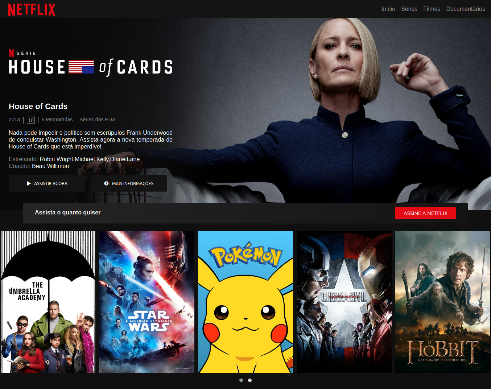
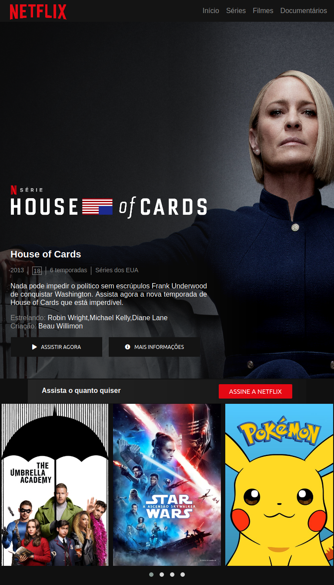
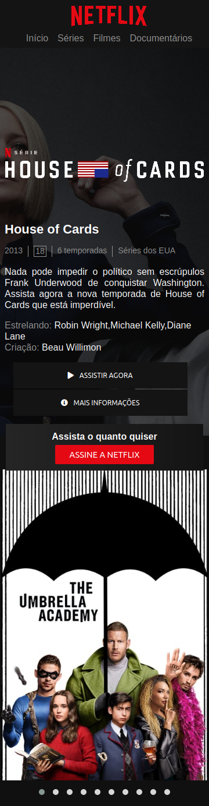

# Clone da interface Netflix

#### Esse projeto consiste no clone da página de apresentação da série House of Cards

O projeto consiste em um banner, detalhes da série, botões e um carousel com séries disponíveis, para o desenvolvimento do carousel foi utilizado o plugin jQuery OWL Carousel 

#### Tecnologias usadas
1. HTML5, CSS3 e JavaScript
2. OWL Carousel
3. jQuery

#### Screenshots

1. Desktop

2. Tablet

3. Smartphone

